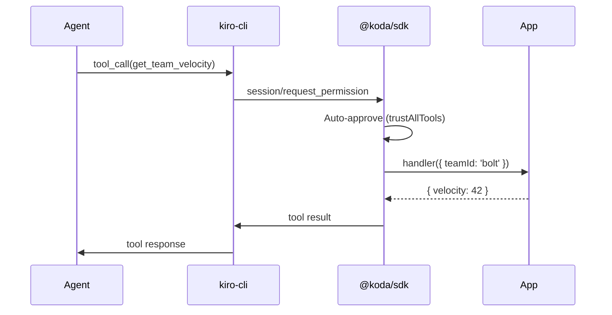

# Tools API

Register app-side functions that agents can invoke via MCP.

## `koda.tools`

```typescript
interface ToolRegistry {
  register(tool: ToolDefinition): void;
  unregister(name: string): void;
  list(): ToolDefinition[];
}
```

## ToolDefinition

```typescript
interface ToolDefinition {
  name: string;
  description: string;
  parameters?: Record<string, { type: string; description?: string }>;
  handler: (params: unknown) => Promise<unknown>;
}
```

## Usage

### Register a Tool

```typescript
koda.tools.register({
  name: 'get_team_velocity',
  description: 'Returns velocity metrics for a team',
  parameters: {
    teamId: { type: 'string', description: 'Team identifier' },
    sprintCount: { type: 'number', description: 'Number of sprints to analyze' },
  },
  handler: async ({ teamId, sprintCount }) => {
    const data = await fetchVelocity(teamId, sprintCount);
    return { velocity: data.avg, trend: data.trend };
  },
});
```

### Unregister a Tool

```typescript
koda.tools.unregister('get_team_velocity');
```

### List Registered Tools

```typescript
const tools = koda.tools.list();
tools.forEach(t => console.log(`${t.name}: ${t.description}`));
```

## How It Works



When an agent calls a registered tool:

1. kiro-cli sends a `session/request_permission` notification
2. SDK auto-approves (if `trustAllTools: true`) or prompts
3. SDK invokes the registered `handler` with the parameters
4. Handler return value is sent back to kiro-cli as the tool result

!!! warning "Handler Errors"
    If a handler throws, the SDK catches the error and returns it as a tool error to the agent. The agent can then decide to retry or report the failure.
