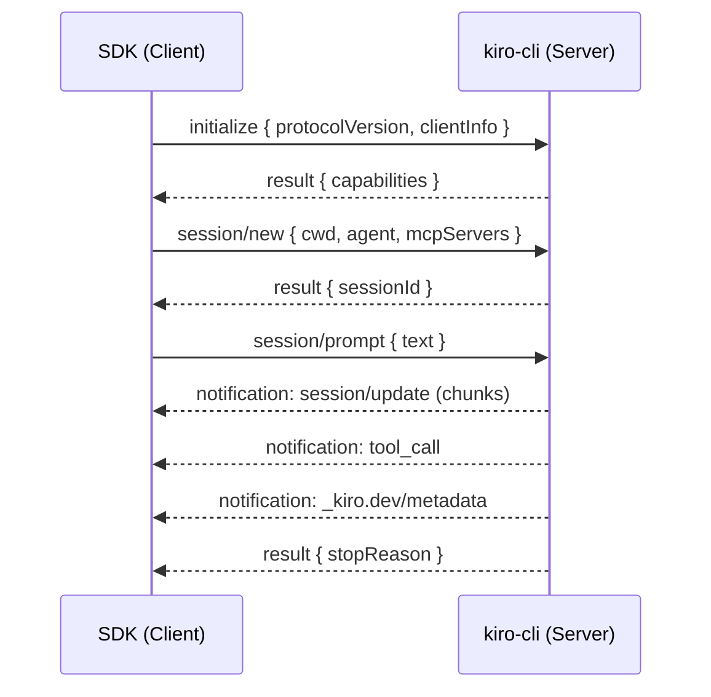
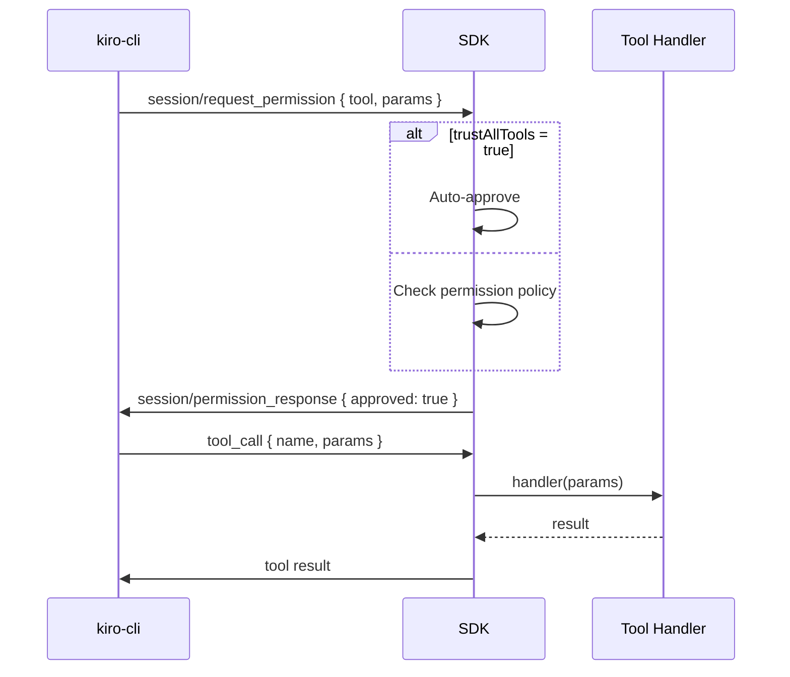

# ACP Protocol

ACP (Agent Communication Protocol) is JSON-RPC 2.0 over stdio, using newline-delimited JSON messages.

## Lifecycle



## Methods (Client → CLI)

| Method | Purpose |
|--------|---------|
| `initialize` | Handshake, declare capabilities |
| `session/new` | Create a conversation session |
| `session/prompt` | Send user message |
| `session/cancel` | Abort current generation |
| `session/permission_response` | Approve/deny tool use |

## Notifications (CLI → Client)

| Method | Purpose |
|--------|---------|
| `session/update` (agent_message_chunk) | Streaming text token |
| `session/update` (tool_call) | Tool invocation started |
| `session/update` (tool_call_update) | Tool progress update |
| `session/request_permission` | Tool permission request |
| `_kiro.dev/metadata` | Context usage percentage |
| `_kiro.dev/subagent/list_update` | Delegation status change |

## Message Format

### Request

```json
{
  "jsonrpc": "2.0",
  "id": 1,
  "method": "session/prompt",
  "params": {
    "sessionId": "abc-123",
    "text": [{ "type": "text", "content": "Analyze sprint health" }]
  }
}
```

### Notification

```json
{
  "jsonrpc": "2.0",
  "method": "session/update",
  "params": {
    "type": "agent_message_chunk",
    "content": "Based on the current"
  }
}
```

### Response

```json
{
  "jsonrpc": "2.0",
  "id": 1,
  "result": {
    "stopReason": "end_turn"
  }
}
```

## Tool Permission Flow



!!! note "Transport"
    ACP uses stdio (stdin/stdout) with newline-delimited JSON. Each message is a single line terminated by `\n`. The SDK's `AcpClient` handles framing, buffering, and request/response correlation via JSON-RPC `id` fields.
