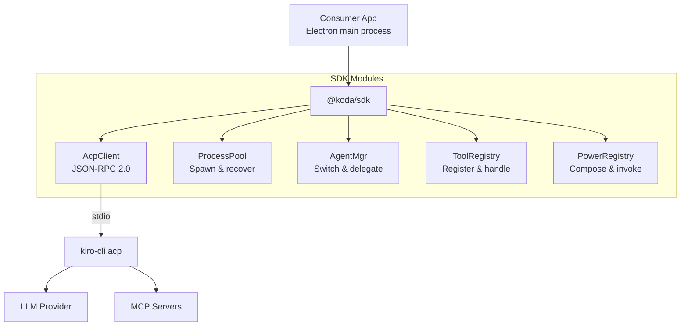
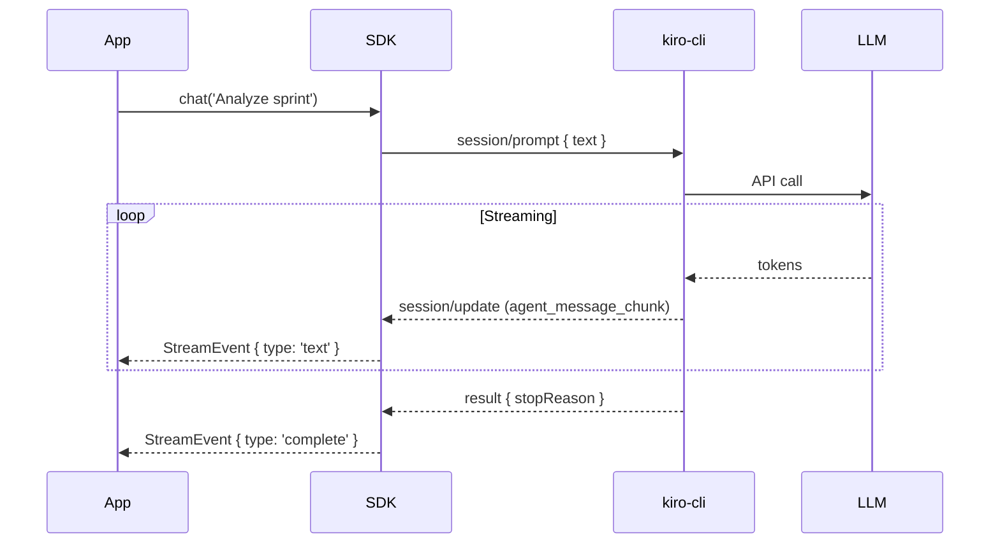

# Architecture Overview

Koda SDK provides a TypeScript abstraction over kiro-cli's ACP (Agent Communication Protocol). It manages the subprocess lifecycle, speaks JSON-RPC 2.0 over stdio, and exposes a high-level async/streaming API.

## System Diagram



## Module Structure

```
@koda/sdk/
├── core/
│   ├── acp-client.ts      — JSON-RPC send/receive, request tracking
│   ├── cli-resolver.ts    — Find kiro-cli binary (cross-platform)
│   ├── process-pool.ts    — Spawn, monitor, restart, per-workspace
│   └── mcp-loader.ts      — Load MCP server configs from ~/.kiro/
├── agents/
│   ├── index.ts           — Agent API (run, list, switch)
│   ├── delegation.ts      — Detect and track sub-agent spawning
│   └── prompt.ts          — Context injection, identity, history
├── streaming/
│   ├── router.ts          — Notification dispatcher
│   ├── assembler.ts       — Chunk → complete message assembly
│   └── async-iterator.ts  — AsyncIterator interface for consumers
├── tools/
│   ├── registry.ts        — Register app functions as MCP tools
│   ├── permissions.ts     — Auto-approve or prompt-based approval
│   └── handler.ts         — Route tool calls to registered handlers
├── sessions/
│   ├── store.ts           — SQLite persistence (messages, metadata)
│   └── export.ts          — Export as markdown, JSON
├── tokens/
│   └── manager.ts         — Secure keychain-backed token storage
├── powers/
│   ├── registry.ts        — Power registration and invocation
│   └── template.ts        — Prompt template expansion
├── discovery/
│   ├── workspaces.ts      — Workspace discovery
│   ├── agents.ts          — Agent discovery
│   └── mcp.ts             — MCP server discovery
└── scoring/
    └── index.ts           — Prompt scoring (POST /score)
```

## Design Principles

| Principle | Description |
|-----------|-------------|
| **Electron-first** | Core runs in Node.js (Electron main). Renderer bridge is optional. |
| **One process per workspace** | Isolation between workspaces. Pool manages lifecycle. |
| **Streaming-native** | All responses are `AsyncIterable<StreamEvent>`. |
| **Zero config** | Auto-discovers kiro-cli, reads MCP from `~/.kiro/`, resolves workspace from cwd. |
| **Fail gracefully** | SDK emits events on failure, never throws unhandled. |
| **Bidirectional tools** | Apps register functions that agents can call. |

## Data Flow


