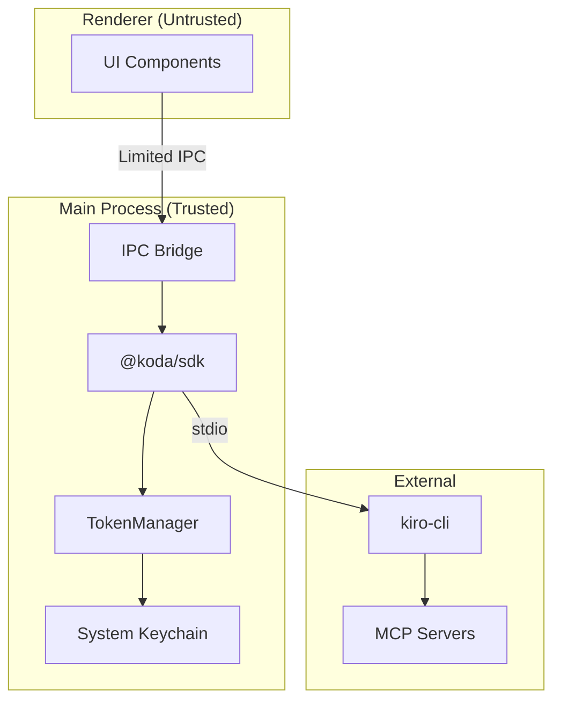

# Security Architecture

## Trust Boundaries



## Token Security

| Guarantee | Implementation |
|-----------|----------------|
| Tokens never reach renderer | IPC bridge exposes `has()` only, not `get()` |
| No plaintext storage | System keychain (macOS Keychain, Windows Credential Manager) |
| Auditable access | All `get()` calls are logged |
| Env injection to MCP | Tokens passed via `env` at spawn, not via app code |

### Resolution Order

1. System keychain
2. `~/.kiro/tokens.env` (fallback)
3. Process environment variables

## Process Isolation

- Each workspace runs its own kiro-cli subprocess
- Subprocesses communicate only via stdio (no shared memory)
- Crash in one workspace doesn't affect others
- ProcessPool handles crash recovery and restart

## IPC Bridge Restrictions

The Electron preload bridge intentionally restricts what's exposed to the renderer:

| Allowed | Blocked |
|---------|---------|
| `chat()` | `tokens.get()` |
| `agents.list()` | Direct process access |
| `agents.switch()` | MCP config mutation |
| `powers.list()` | File system access |
| `powers.run()` | CLI path override |
| `tokens.has()` | `tokens.set()` / `delete()` |

## Tool Permissions

With `trustAllTools: true` (default), all tool calls are auto-approved. For stricter control:

```typescript
const koda = new KodaSDK({
  appName: 'secure-app',
  trustAllTools: false, // Requires explicit approval
});
```

!!! warning
    When `trustAllTools: false`, the SDK will emit a `permission_request` event for each tool call. Your app must respond with approval or denial, or the agent will hang.

## MCP Server Security

- MCP servers run as child processes of kiro-cli
- Credentials passed via environment variables at spawn
- Server configuration is read-only from the SDK's perspective
- The SDK cannot start/stop/modify MCP servers directly
