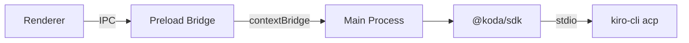

# Electron Setup

The SDK runs in Electron's **main process**. The optional `@koda/sdk-electron` package provides a secure IPC bridge to expose a subset of the API to the renderer.

## Architecture



## 1. Main Process Setup

```typescript
// main.ts
import { KodaSDK } from '@koda/sdk';

const koda = new KodaSDK({
  appName: 'my-electron-app',
  workspace: '/path/to/workspace',
});

app.on('before-quit', () => koda.disconnect());
```

## 2. Preload Bridge

```typescript
// preload.ts
import { createKodaBridge } from '@koda/sdk-electron';

createKodaBridge(); // exposes window.koda
```

This uses Electron's `contextBridge` to expose a safe API:

```typescript
// Available in renderer as window.koda:
interface KodaBridge {
  chat(prompt: string, options?: ChatOptions): void;
  on(event: 'text' | 'toolCall' | 'complete' | 'error', handler: Function): void;
  off(event: string, handler: Function): void;
  agents: { list(): Promise<AgentInfo[]>; switch(id: string): Promise<void> };
  powers: { list(): Promise<Power[]>; run(id: string, params?: object): void };
}
```

!!! warning "Security Boundary"
    The bridge intentionally excludes:

    - `tokens.get()` — renderer can only call `tokens.has()`
    - Direct process/subprocess access
    - MCP server configuration mutation

## 3. Renderer Usage

```typescript
// renderer.ts
const stream = window.koda.chat('Analyze sprint health');
stream.on('text', (chunk) => appendToUI(chunk));
stream.on('complete', ({ fullContent }) => renderMarkdown(fullContent));
stream.on('error', (err) => showError(err.message));
```

## 4. With React Components

```tsx
import { ChatPanel } from '@koda/sdk-react';

function App() {
  return (
    <ChatPanel
      sdk={window.koda}
      placeholder="Ask about your sprint..."
      showToolCalls={true}
    />
  );
}
```

## Token Security in Electron

Tokens are stored in the system keychain (macOS Keychain / Windows Credential Manager):

```typescript
// Main process only:
await koda.tokens.set('JIRA_PAT', 'secret-value');

// Renderer can check existence but never read:
const hasToken = await window.koda.tokens.has('JIRA_PAT'); // true
```
