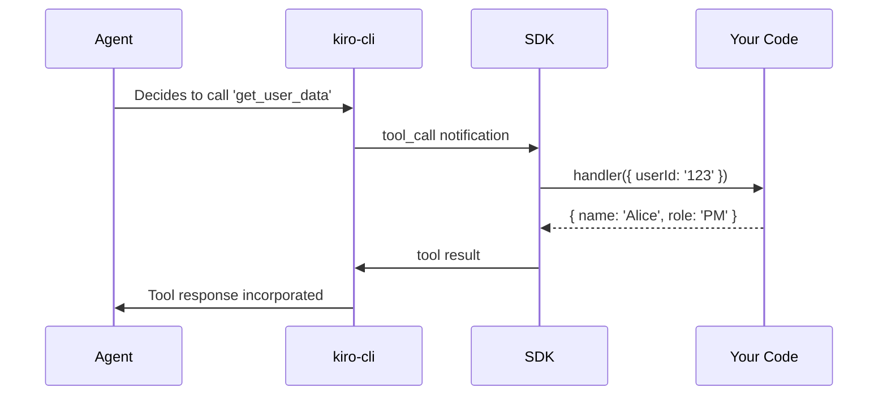

# Tools Guide

Register app-side functions that AI agents can invoke via MCP. This enables agents to access your application's data and capabilities.

## How Tools Work



## Registering Tools

```typescript
koda.tools.register({
  name: 'get_user_data',
  description: 'Retrieve user information by ID',
  parameters: {
    userId: { type: 'string', description: 'User identifier' },
  },
  handler: async ({ userId }) => {
    const user = await db.users.findById(userId);
    return { name: user.name, role: user.role, team: user.team };
  },
});
```

### Best Practices

!!! tip "Tool Design"
    - **Descriptive names**: Use verb_noun format (`get_sprint_data`, `search_tickets`)
    - **Clear descriptions**: The agent uses this to decide when to call the tool
    - **Typed parameters**: Specify type and description for each parameter
    - **Focused return values**: Return only what's needed, not entire database rows

## Parameter Types

```typescript
parameters: {
  teamId: { type: 'string', description: 'Team identifier' },
  limit: { type: 'number', description: 'Max results to return' },
  includeArchived: { type: 'boolean', description: 'Include archived items' },
}
```

## Error Handling

If your handler throws, the SDK catches the error and reports it to the agent:

```typescript
koda.tools.register({
  name: 'get_sensitive_data',
  description: 'Fetch data with access control',
  parameters: { resource: { type: 'string' } },
  handler: async ({ resource }) => {
    if (!hasAccess(resource)) {
      throw new Error('Access denied: insufficient permissions');
    }
    return fetchData(resource);
  },
});
```

The agent receives the error message and can decide to retry, ask for clarification, or report the failure.

## Dynamic Registration

Register and unregister tools based on app state:

```typescript
// Register when a view opens
function onDashboardOpen() {
  koda.tools.register({
    name: 'get_dashboard_metrics',
    description: 'Current dashboard metrics',
    handler: async () => getDashboardState(),
  });
}

// Unregister when view closes
function onDashboardClose() {
  koda.tools.unregister('get_dashboard_metrics');
}
```

## Listing Registered Tools

```typescript
const tools = koda.tools.list();
tools.forEach(t => console.log(`${t.name}: ${t.description}`));
```

!!! warning "Tool Naming"
    Tool names must be unique across your app and all MCP servers. Use a prefix to avoid collisions: `myapp_get_users` instead of `get_users`.
